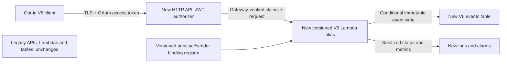

# Isolated JEL-JKB/6.0 migration decision — 2026-09-24

Status: PROPOSED, not deployed. Recommend a new isolated Python V6 Lambda and a
new event-oriented DynamoDB table. Preserve both live runtimes, all existing
tables, routes, credentials, and source history. No AWS calls were made for this
design; live statements below refer only to PR #5's dated evidence.

## Evidence anchors

Read AGENTS.md and issue #1. Preserve PR #3 (8b42fd0...) as characterization,
PR #4 (cbe8eeff...) as the remediation candidate, and PR #5 (a4c2c266...) as the
2026-09-24 04:54–04:57 UTC compatibility snapshot, not timeless runtime truth.
Full anchors:
- [PR #3](https://github.com/DevF-DFSS/jakob-dna/pull/3): 8b42fd0ebc5850a82e2629006677ad41900c1748
- [PR #4](https://github.com/DevF-DFSS/jakob-dna/pull/4): cbe8eeff045802a305a98b78d743328f17403dcf
- [PR #5 evidence](https://github.com/DevF-DFSS/jakob-dna/blob/a4c2c2666345e663e9f0678878b3c0e1abcc6a9a/audits/aws-compatibility-2026-09-24/evidence.json)
- [Issue #1](https://github.com/DevF-DFSS/jakob-dna/issues/1)

PR #5 observed DFSS-ColdStart (Node.js 24, index.handler, us-east-1) and
us-os-brain (Python 3.12, lambda_function.lambda_handler, us-east-2). Neither had
TABLE_NAME. Four table schemas conflicted with PR #4. Three HTTP API routes
used authorization NONE. Package digests exist but source lineage is unproved.
The historical SOP is not evidence of present table keys or deployment.

## Runtime decision matrix

| Strategy | Reuse benefit | Compatibility/coupling cost | Preservation and rollback | Decision |
|---|---|---|---|---|
| Adapt DFSS-ColdStart | Existing portal /session integration | Node.js-to-Python/runtime transition or separate rewrite; unknown current behavior; caller contract changes; missing TABLE_NAME and authenticated ingress | High risk to portal; no observed version/alias baseline; prior package recovery must be proven | Defer; not a first migration |
| Adapt us-os-brain | Python runtime and handler name match PR #4 | Unknown model/handshake behavior; secret-dependent functionality; us-east-2 storage mismatch; multiple API entry points; no authenticated gateway | Moderate/high risk despite language match; would replace evidence-bearing behavior | Defer until behavioral/package lineage is proven |
| New isolated V6 runtime | Reuse reviewed validation ideas and tests without substituting legacy function | New endpoint, auth provisioning, deployment pipeline, observability and caller opt-in needed | Best isolation; new alias rollback and opt-in client rollback; legacy remains intact | Recommended |

No numerical scoring implies measured cost/performance. Isolation has higher setup
cost but avoids an unproved replacement. Prefer a dedicated sandbox account first;
account ownership/access remains 🐈📦. Proposed pilot region us-east-1 is a choice
for co-located new resources, not a claim that legacy code belongs there. Confirm
residency/latency before implementation. In a same-account sandbox, use distinct
resource names, roles, boundary controls and no grants to legacy data; naming alone
does not isolate permissions.

## Persistence decision matrix

| Strategy | Existing evidence | Benefits | Risks / reversibility | Decision |
|---|---|---|---|---|
| Adapt candidate to existing schema | jakob-memory-store: memoryId:S / timestamp:N; DFSS_SessionState: session_id:S / timestamp:S; identity: profileId:S / version:N; us-os-memory: session-id:S only | Potential existing read models/operations, once understood | Requires semantic mapping, reader audit, index effects and collision proof. Merely renaming userId to memoryId is not a migration. Same-table writes mingle new and legacy evidence | Defer; no existing table selected |
| New V6 table | No compatible existing base key in PR #5 | Explicit schema, isolation, atomic event receipts, no backfill needed initially | New readers, retention/cost and export plan needed; disable writes without deleting evidence | Recommended |

A clean table with PR #4's userId/timestamp keys would unblock one mechanical
issue but retain same-millisecond collision semantics. Recommend PK/SK event keys
below instead. This is a new isolated persistence profile, not an assertion that
PR #4 already supports it. PR #4 remains unchanged and is not deployable as-is.

## Proposed architecture



Pilot implements durable envelope acceptance and receipt lookup only. It does
not execute instruction text, fetch payload_ref, call a model, forward to legacy,
or emit downstream side effects. Acceptance is not proof of external execution.
If execution is added later, design a transactional outbox plus idempotent worker;
an accepted receipt alone is not exactly-once execution.

## Five independent security and correctness layers

| Layer | Proposed control | Does not prove |
|---|---|---|
| Transport authentication | TLS plus HTTP API JWT authorizer; exact approved issuer and dedicated audience, required route scope; Authorization header only | That any claimed sender/receiver is authorized |
| Sender authorization/binding | Backend maps validated principal to server-owned tenant, allowed sender, receiver and instruction sets; default deny | Payload or referenced object integrity |
| SHA-256 integrity | Preserve PR #4's exact nine-field canonical UTF-8 envelope hash and nested integrity validation | Identity, permission, authenticity or reference contents |
| Replay/freshness | Separate submission issued_at; proposed age <=300s and future skew <=30s, server clock; reject stale submissions even if duplicated | Unique business event identity |
| Event identity/idempotency | UUIDv4 event_id fixed across retries, scoped to server tenant+sender, conditional insert and stored full-request digest | Protection against an authorized caller minting new IDs for semantically duplicate events |

Authentication provider: propose a new dedicated Cognito/OIDC issuer and app
registrations for sandbox V6; no reuse or rotation of legacy secrets. Browser
clients use authorization code + PKCE with no embedded client secret. Machine
clients use separately approved workload/client credentials held outside browser
and source. Exact provider/flows/claim shape are 🐈📦 pending validation.

Require a JWT access-token profile with immutable iss, sub and client_id claims,
and a dedicated audience. If chosen issuer cannot supply that exact profile,
approve a revised machine identity mapping rather than falling back to request
sender/email. Registry key is the tuple (iss, sub, client_id). Registry entries
map to a server-owned tenant_id plus allowed senders/receivers/instructions.
Human and service registrations are disjoint. No self-enrollment from requests.
Version and review binding changes; fail closed if registry is absent/invalid.

API Gateway verifies signature/issuer/audience/time and scope; Lambda uses only
requestContext.authorizer.jwt claims from trusted API ingress, never body/header
copies. Lambda must also check expected API/stage context and binding policy.
That context is not cryptographic proof for direct Lambda invocation: only the
new API may invoke its alias, with tightly controlled break-glass deployment
principals. No public Function URL, direct invocation grants to clients, or NONE
fallback route. Test forged authorizer contexts through alternate invocation paths.
Binding revocation takes effect via configuration release; emergency disable
of the new ingress is the immediate response. Cached JWT keys/token lifetimes
mean revocation latency must be measured, not assumed instantaneous.

AWS route scope matching accepts at least one configured scope, so use one exact
scope per route, not a list intended as an AND condition. Require
jel-v6/write for POST and jel-v6/read for GET. Scopes do not replace per-sender
authorization. See [HTTP API JWT authorizers](https://docs.aws.amazon.com/apigateway/latest/developerguide/http-api-jwt-authorizer.html).
Do not copy that page's illustrative query-token/implicit-flow examples.

## Transport contract and schema

POST /v6/events accepts exactly:
```json
{
  "profile": "JEL-JKB/6.0-isolated/1",
  "event_id": "11111111-1111-4111-8111-111111111111",
  "issued_at": "2026-09-24T12:00:00.000Z",
  "envelope": {
    "protocol": "JEL-JKB/6.0",
    "sender": "synthetic-sender",
    "receiver": "synthetic-receiver",
    "timestamp": "2026-09-24T11:59:00.000Z",
    "context_mode": "HIGH_BANDWIDTH",
    "jel": "synthetic-test",
    "payload_ref": "urn:synthetic:example",
    "integrity": {"algorithm": "SHA-256", "digest": "<computed lowercase 64-hex digest>"},
    "instruction": "REHYDRATE_AND_VALIDATE",
    "fallback": "STOP_AND_REPORT_DRIFT"
  }
}
```

Example is schematic, not a valid signed test vector. Envelope remains exactly
the canonical ten fields; event_id is not silently inserted into that envelope.
The new transport wrapper requires a new parser/handler beyond PR #4.
issued_at is submission time and freshness input; envelope.timestamp retains
the claimed historical state time. Both are validated UTC timestamps, never
silently replaced. A delayed historical envelope may be submitted with fresh
issued_at under explicit authorization; do not confuse that with historical proof.

Validate transport shape/size, trusted identity/binding, envelope schema/digest,
and issued_at before persistence. Use strict duplicate-member rejection, UTF-8
validation and canonicalization rules from PR #4; cap complete request at 64 KiB
and decode base64 under a bounded limit. Lowercase canonical UUIDv4 only.
Compute request_digest over canonical JSON of the complete wrapper, with nested
envelope including integrity. Binding metadata is server-derived, never accepted
from request fields. TLS/auth protects wrapper transport; request_digest binds
the saved wrapper for idempotency, not cryptographic sender authentication.

Proposed table, illustrative name jel-v6-events-sandbox:

| Attribute | Type and role |
|---|---|
| PK | String: canonical JSON array [tenant_id, sender], collision-free escaping, validated lengths |
| SK | String: EVENT# plus canonical event_id |
| profile | String: JEL-JKB/6.0-isolated/1 |
| request_digest | String: SHA-256 of complete canonical wrapper |
| envelope | Map: exact validated V6 envelope |
| issued_at | String: validated submission time |
| accepted_at_ms | Number: server timestamp; distinct from claimed event time |
| principal_ref | Server-derived non-secret identity reference/hash; no access token |
| binding_version | Immutable binding registry version |
| receipt | Map: event_id, accepted status, stable accepted_at_ms |

No initial GSI, streams, automatic TTL, scan endpoint or legacy backfill. Events
and receipts are one immutable item. Retention/PITR and cost limits require
approval; no runtime deletes. A future retention policy must preserve an event-ID
tombstone for its promised idempotency horizon. TTL deletion is never the replay
clock and must not silently allow old IDs to become new events.

Atomic conditional PutItem checks absence of the target key. On conflict, read
the same key with ConsistentRead=true, then compare request_digest:
same digest => 200 and original receipt; different digest =>409; missing record or
uncertain storage result =>503/retry, never a fabricated success. First acceptance
=>201. Validate auth/binding/freshness on EVERY retry before lookup. Exact replay
within window yields only the receipt, never a second write/side effect. Once
stale, POST rejects; authorized GET can retrieve the existing receipt. Do not
change issued_at on retry: changed wrapper under the same ID is a conflict.

Conditional writes and strong reads are distinct requirements:
[PutItem](https://docs.aws.amazon.com/amazondynamodb/latest/APIReference/API_PutItem.html),
[GetItem](https://docs.aws.amazon.com/amazondynamodb/latest/APIReference/API_GetItem.html).
A conditional write against an event ID permits distinct events in the same
millisecond. This intentionally supersedes PR #4's storage proposal only for the
new profile, not its original branch or historical records.

## Required resources, routes, configuration and permission boundaries

All names below are proposals, not observed resources. First deployment requires
separate approval and a reviewed nonproduction IaC change.

| Resource | Required configuration |
|---|---|
| New sandbox account or approved isolated sandbox scope | No cross-account/legacy data grants; region fixed for new API/Lambda/table |
| New HTTP API jel-v6-sandbox | Explicit sandbox stage; AutoDeploy=false; no default/ANY route; JWT authorizer |
| POST /v6/events | Scope jel-v6/write; V6 submission; no legacy forwarding |
| GET /v6/senders/{sender}/events/{event_id} | Scope jel-v6/read; exact sender binding before lookup; server tenant; receipt only; no arbitrary partition lookup |
| New Lambda jel-v6-ingress-sandbox | Python version supported at implementation time; pinned dependencies; published version plus sandbox alias; runtime configuration validated at startup |
| New DynamoDB table | PK:S / SK:S as above, on-demand initial capacity, PITR and deletion protection proposed; encryption at rest; retention decision explicit |
| New identity registrations | Dedicated issuer/audience/scopes and test identities; no imported legacy credentials |
| New execution role | Lambda trust; only new table/log resources; no legacy role reuse |
| New logs/metrics/alarms | Configurable retention; status/reason/latency/counts, hash-based correlation, no tokens, raw envelopes or secret-bearing refs; alarms for rejected auth, conflicts, 5xx and throttles |
| Versioned binding registry | Packaged reviewed configuration for pilot; updates produce a new config/version; contains identifiers and policy, not credentials |
| Build/provenance artifact | Source SHA, lockfile, build/tool versions, tests, ZIP digest and alias/version receipt; no assumed old package relationship |

Required future IAM capabilities (design requirements, not generated/attached policies):
- Runtime: dynamodb:PutItem and dynamodb:GetItem scoped only to new table ARN;
  no UpdateItem/DeleteItem/Scan/Query or legacy data access. Conditional writes
  still use PutItem. Receipt reads use exact scoped keys and backend binding.
- Logging: logs:CreateLogStream and logs:PutLogEvents on the pre-created new log
  group. Provisioning, not runtime, creates the log group.
- Invocation: lambda:InvokeFunction resource permission for apigateway.amazonaws.com
  only on the new alias and specific API/stage/method/path, with SourceAccount
  and SourceArn restrictions. End-user scopes are enforced by JWT, not an API key.
- Runtime has no Secrets Manager/KMS decrypt/model API permissions by default.
  If later approved encryption/secret integrations require them, derive narrowly
  scoped grants after design review; do not reuse DynamoDBFullAccess.
- Separate deployment role provisions only approved new resources and can pass
  only the dedicated role to Lambda. Generate its exact policy from reviewed IaC;
  no wildcard legacy updates or credential rotation permissions.

These are capability requirements, not a hand-written deployable IAM policy.
After the new Python implementation exists, generate the identity-policy baseline
from all real runtime SDK sources and review effective access:
```sh
uvx iam-policy-autopilot@latest generate-policies /absolute/path/to/approved-v6/runtime.py --region us-east-1 --account APPROVED_SANDBOX_ACCOUNT_ID --service-hints dynamodb logs --pretty
```
Replace the illustrative absolute path and account with approved values; include
all runtime SDK source files. Tool availability/version must be verified then,
and the version pinned for reproducibility. No upload flag, generation, install
or IAM write was performed here. Resource policies and organization/boundary
controls require separate review; PR #5's placeholder simulation is not proof.

| Environment/config key | Proposed value/meaning |
|---|---|
| V6_TABLE_NAME | Explicit new table, fail closed if missing; no legacy default |
| EXPECTED_REGION | Approved region; compare against managed AWS_REGION at startup |
| EXPECTED_API_ID / EXPECTED_STAGE | Exact new API and sandbox stage |
| EXPECTED_ISSUER / EXPECTED_AUDIENCE | Approved dedicated identity provider settings; must agree with Gateway |
| BINDINGS_VERSION / BINDINGS_PATH | Version and packaged file path; startup validation |
| TRANSPORT_PROFILE | JEL-JKB/6.0-isolated/1 |
| MAX_AGE_SECONDS / FUTURE_SKEW_SECONDS | Proposed 300 / 30; policy-reviewed before deployment |
| MAX_REQUEST_BYTES | 65536, including wrapper |
| LOG_LEVEL | INFO, no raw request/exception dumps |

Do not supply GEMINI_API_KEY or SECRET_HANDSHAKE_TOKEN to this runtime; no model
calls or shared-secret authorization are in scope. This is non-use, not rotation
or removal from legacy. Cognito client credentials, if selected for machines, live
in the client credential-management boundary, not these Lambda environment keys.

## Migration sequence with rollback points

| Phase | Gate / action proposed | Rollback and preservation |
|---|---|---|
| 0: decision only | Review this design, ownership and risks; refresh PR #5 evidence later before any provisioning | No runtime changes to roll back |
| 1: offline implementation | New implementation branch/profile; adapt validation from PR #4, add wrapper/auth binding/event store; do not edit PRs #3–5 | Discard/revert new code only; baseline branches intact |
| 2: sandbox provisioning | Explicit approved change set for NEW account/resources; inspect IAM diff and resource naming; synthetic identities/data only | Disable new ingress; retain artifacts/receipts; remove disposable resources only under separate approval |
| 3: isolated validation | Real SDK, JWT, concurrent writes, denial tests, fault injection; publish artifact/version evidence | Roll sandbox alias back to tested compatible version; stop writes if schema incompatibility; never point V6 traffic at legacy |
| 4: opt-in pilot | Explicit approval; adapters send copies only where permitted, with original source reference and conversion provenance; no model side effects | Disable pilot; preserve accepted receipts. Never auto-resubmit uncertain writes to legacy or mint new IDs |
| 5: reader migration | Prove new readers work, receipt semantics and historical distinction; no automatic bulk import | Revert reader feature flag to existing read path; V6-only data remains in V6 for later reconciliation |
| 6: production proposal | Separate IaC/account, authorization, performance, cost, support and rollback review; approvals for actual changes | Stop new ingress and revert compatible alias/client feature flags; retain data. Code rollback does not undo accepted events |
| 7: optional legacy replacement | Only after provenance and consumer equivalence, explicit decommission/data plan and approval | Not part of recommendation. Keep legacy until independent replacement decision |

No deployment scripts, SAM/CDK templates or automatic CI deployment are included.
Do not mirror production requests with tokens/secrets into sandbox. Later approved
imports must retain original timestamp and source identity, add import provenance,
and never claim newly computed checksums prove historical authenticity.

## Compatibility risks and tests before production

Legacy portal sends session_id/node/system_state, not the new wrapper or V6
envelope. Adapters must be explicit, authenticated and provenance-bearing; they
cannot invent sender authority, payload_ref or historical integrity. Existing
readers may expect memoryId, session-id, userId-index/sessionId-index or root-level
fields. New data uses PK/SK and nested envelope; migration must be versioned.
New statuses 201/200/409/422/401/403/503 and stable event IDs require client changes.
No silent fallback from rejected V6 to a less protected legacy endpoint.

Required gates:
1. Preserve PR #4 malformed/Unicode/duplicate JSON/integrity regressions; add exact
   wrapper parsing, byte caps, timestamp and event-ID boundary tests.
2. Real JWT tests: invalid signatures, issuer/audience/token type/scope, expiry,
   future nbf/iat, key changes, browser/machine profiles and revocation latency.
3. Binding tests: spoofed sender/tenant, wrong receiver/instruction, unknown or
   removed principal, changed registry, GET cross-tenant enumeration, direct
   invocation/context forgery and wrong API/stage.
4. Real DynamoDB conditional races: same-ID same-body retry, conflicting body,
   parallel independent IDs at identical times, lost response, permission denial,
   throttling, consistent read and uncertain commit recovery. No duplicate effects.
5. Boundary clock tests: age/future skew inclusive limits, stale POST receipt
   lookup via GET, timestamp preservation and replay after proposed retention.
6. Permission tests: scoped IAM allow for new resources, deny all legacy tables
   and functions, effective SCP/boundary review; concrete ARN results required.
7. Compatibility/operational gates: producer/consumer fixtures, real SDK marshalling,
   package reproducibility, synthetic load/latency/cost, alarms without PII/secret
   leakage, backup/restore, alias rollback and feature-flag disable drills.
8. Independent review confirms no legacy IaC diff, no unapproved credential
   operations and no public unauthenticated alternative to the new ingress.

The included pure-Python model tests only authorization tuples, freshness,
request binding and in-memory idempotency. It does not verify JWTs, implement the
full envelope validator, model DynamoDB concurrency, or constitute deployable code.
No production readiness claim follows from passing it.

## Unresolved decision register

- 🐈📦 Approved sandbox/production accounts, region/residency, resource ownership,
  budget, retention, recovery objectives and support owner.
- 🐈📦 Identity provider, machine/human claim profiles, principal registry owner,
  authorization sets and immediate revocation mechanism.
- 🐈📦 Acceptance of the new wrapper/profile and PK/SK choice; event-ID ownership,
  freshness limits, duplicate semantics and retention horizon.
- 🐈📦 Legacy package lineage, actual model/handshake behavior, current consumers
  and importer semantics. PR #5 evidence is dated, not reverified here.
- 🐈📦 Reference-content authorization/integrity. Pilot never fetches payload_ref.
- 🐈📦 Real SDK/service tests, effective IAM, performance/cost, JWT issuer behavior,
  artifact supply chain and operational rollback proof.
- 🐈📦 Whether execution/routing beyond durable receipt acceptance is needed;
  no outbox/worker/model capabilities are implied.
